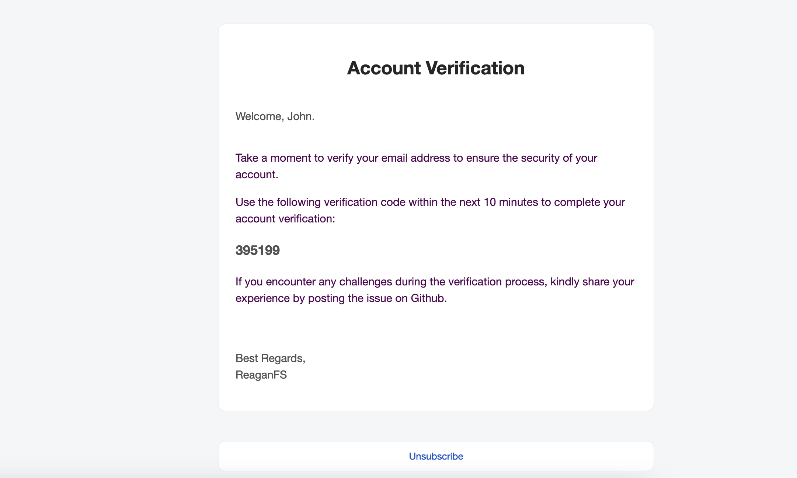
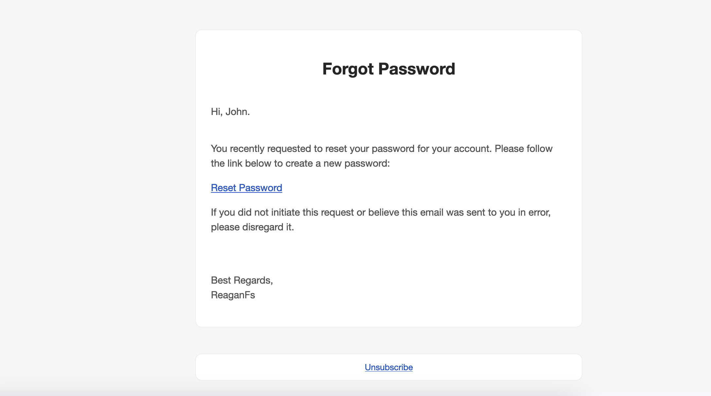

# Nuxt 3 Authentication using MongoDB, Refresh access token & Email Verification.

This demo showcases seamless user authentication, featuring a refresh access token mechanism for API route protection. After registering, a verification email will be sent same thin when requesting a password reset. All-in-one example covering sign up, sign in, account verification, and password management.

Account Verification email template.

Password Reset email template
